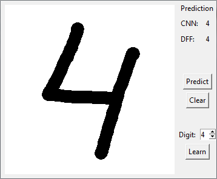

# tkinter-digits-recognition
#### My first tkinter GUI allows to draw digits, predict them and train both networks using drawn digits
##### Digits recognition is realized by trained convolutional and deep feed forward neural networks

